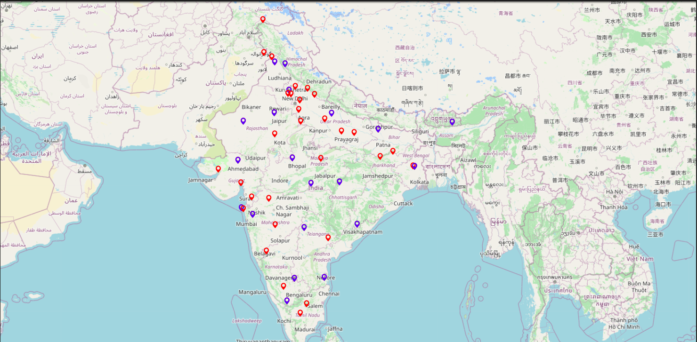
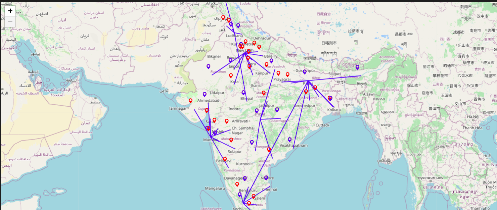

# Capacitated Facility Location Problem (CFLP)

## Overview

This project addresses the Capacitated Facility Location Problem (CFLP). Given \( n = 108 \) demand locations, the objective is to determine the optimal placement of  facilities such that the total distance between demand points and facilities is minimized while satisfying capacity constraints.

## Project Structure

- `README.md`: Contains all the information about the project.
- `data.ipynb`: Writes all the information, such as location coordinates, cost of setting up the facility, capacities, and demand of the facilities and demand zones, and combines it into a JSON file.
- `data.json`: The combined data file.
- `Capacitated_Facility_Location.ipynb`: Has the final code for solving the CFLP.

## Files

### data.json

This file includes the combined data necessary for solving the facility location problem, including the location coordinates, capacities, and demands.

### data.ipynb

This notebook converts location coordinates, costs, capacities, and demands stored in dictionaries into a JSON file, which is used for solving the CFLP.

### Capacitated_Facility_Location.ipynb

This notebook solves the Capacitated Facility Location Problem. Given \( n = 50 \) demand locations, it determines which \( m = 20 \) facilities should be set up to minimize the total distance and construction cost while satisfying capacity constraints.

## Problem Statement

Given \( n = 50 \) demand locations, we need to select \( m = 20 \) cities that can fulfill the entire demand of the demand zones while minimizing the cost of facility constructions and minimizing the distance.

## Mathematical Model

The objective is to minimize the cost of setting up the facility and the transportation cost (distance). The mathematical formulation is as follows:


### Objective Function

$$ \text{Minimize} \quad \sum_{i} (C_i Y_i) + \sum_{i} \sum_{j} (x_{ij} \cdot D_{ij}) $$

where:
- $C_i$ is the capacity of facility $i$
- $D_{ij}$ is the distance between facility $i$ and demand node $j$

### Constraints

1. Capacity constraint for each facility:
   
$$ \sum_{j} (x_{ij} \cdot p_j) \leq Q_i Y_i \quad \text{for every } i $$

where:
- $p_j$ is the demand of node $j$
- $Q_i$ is the capacity of facility $i$
- $Y_i$ is a binary variable indicating whether facility $i$ is selected

2. Each demand point is connected to exactly one facility:

$$ \sum_{i} x_{ij} = 1 \quad \text{for every } j $$


4. Ensure that the capacity of the facility is more than the total demand of the connected demand nodes.


### Input Data

1. Facilities and Demand Nodes
   - Blue: Facilities
   - Red: Demand Nodes
   

2. Final Output
   

## Installation

Clone the repository:

```sh
git clone https://github.com/RishiSoni08/Capacitated_facility_location_Problem.git
```
## Usage

1. **Prepare your location coordinates data in a dictionary format.**
2. **Generate the JSON data file:**
    - Open and run `data.ipynb`.
    - This will create a `combined_data.json` file with all the necessary information.
3. **Solve the CFLP:**
    - Open and run `Capacitated_Facility_Location.ipynb`.
    - This notebook will use the data from `combined_data.json` to find the optimal locations for the facilities and the assignment of demand nodes to these facilities while minimizing the total cost.

## Contributing

Contributions are welcome! Please create a pull request or open an issue to discuss what you would like to change.

## License

This project is licensed under the MIT License.

## Contact

For any questions or suggestions, please contact [rishi25soni@gmail.com].
